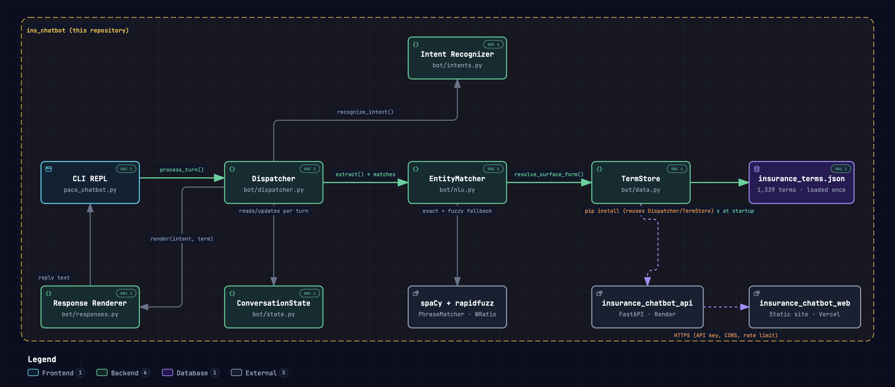

# 💬 Insurance Knowledge Assistant

A conversational assistant that teaches insurance terminology through natural, multi-turn conversation — built to demonstrate intent recognition, entity resolution, and fuzzy matching, hand-built and unit-tested rather than dropped in from an NLU framework or an LLM.

## 🎯 Business Problem

Insurance projects are full of domain vocabulary — "ALAE," "IBNR reserves," "workers comp" — that anyone new to the field (developers, testers, architects) has to pick up on the fly.

That knowledge usually lives in scattered chat threads and PDF glossaries: asked inconsistently, answered inconsistently, and never written down anywhere reusable.

A searchable glossary helps you look a term up. It doesn't help you learn it.

## 💡 Solution

> **What if the glossary could hold a conversation?**

The assistant answers definition, example, comparison, and category questions against a 1,339-term insurance glossary, and holds real multi-turn dialogue — a user can ask "what's a premium?", follow up with "give me an example," then "how's that different from replacement cost?" without ever repeating the term. It can also quiz the user on what they've learned.

It's deliberately scoped to internal, non-PII learning: no account access, no claims lookup, no real policy data — it only ever talks about the *glossary*, never about a real person's insurance.

A live demo is available at [insurance-chatbot-web.vercel.app](https://insurance-chatbot-web.vercel.app/).

<p align="center">
  
</p>

## 🏗️ Architecture

<p align="center">
  
</p>

<p align="center">
  <a href="https://pacordev.github.io/paco_insurance_chatbot/ins_chatbot_architecture.html">View the full architecture diagram interactively</a>
</p>

Every incoming message travels through a fixed pipeline:

```
User → Web Frontend (Vercel) → FastAPI (Render) → Dispatcher.process_turn()
                                                       │
                                                       ├─▶ Intent Recognition   "what do they want?"
                                                       │
                                                       ├─▶ Entity Matching      "which glossary term is this about?"
                                                       │        exact match (spaCy PhraseMatcher)
                                                       │        → fuzzy fallback (rapidfuzz)
                                                       │        → TermStore ── insurance_terms.json (1,339 terms)
                                                       │
                                                       ├─▶ Conversation State   multi-turn context, quiz progress
                                                       ▼
                                                  Response Renderer ── reply, back through FastAPI and the frontend
```

`Dispatcher`/`TermStore` are the only two things the FastAPI layer depends on — it `pip install`s this repo unmodified, so the NLP core stays testable and deployable on its own.

## 🧠 Engineering Highlights

- Two-stage entity resolution: exact phrase matching (spaCy `PhraseMatcher`, longest-match preference) with a typo-tolerant fuzzy-matching fallback (`rapidfuzz`)
- Priority-ordered intent classification, resolved independently of entity matching and recombined by the dispatcher
- Ambiguity handling — "did you mean X or Y?" disambiguation turns instead of guessing wrong
- Multi-turn dialogue-state tracking (last term, last intent, pending disambiguation, quiz progress)
- Randomized, name-personalized response templates
- A decoupled core: the same `Dispatcher`/`TermStore` package powers the CLI, the API, and the web frontend with zero changes

## 🧪 Testing

68 hand-written regression tests across ~810 lines, covering the entity matcher, intent classifier, response templates, dataset integrity, and full multi-turn dispatcher flows, including quiz mode.

## 🛠️ Technology

Python · spaCy · rapidfuzz · FastAPI · Vercel · Render

---

📖 For the full project structure, setup instructions, detailed tech-stack rationale, current status, and known limitations, see **[docs/TECHNICAL.md](docs/TECHNICAL.md)**.
