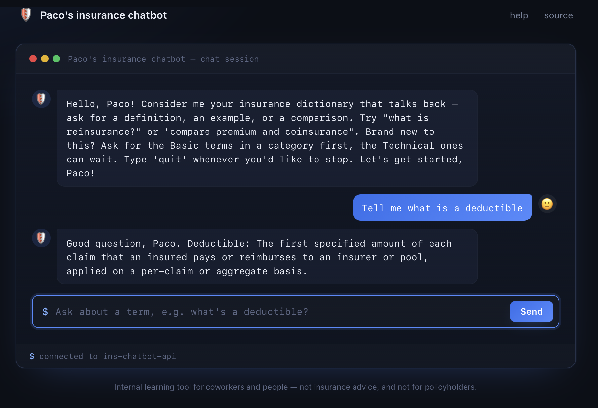
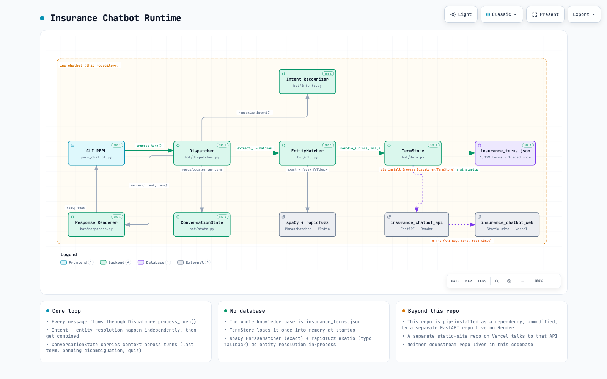

# Paco's Insurance Terminology Chatbot - v1.5

A little chatbot that came to my mind to help coworkers, or people in general, who aren't insurance people — developers, architects, testers, anyone who joins a project and suddenly has to deal with terms like "ALAE" or "IBNR reserves" — actually understand the vocabulary without having to bug someone or dig through a PDF glossary. It's also, honestly, my excuse to get more comfortable with Python.

This README describes the project as it stands today: why it exists, what's been built, and how it's currently deployed. I'll keep it updated as things change.

**Try it:** <a href="https://insurance-chatbot-web.vercel.app/" target="_blank" rel="noopener noreferrer">chat with the bot</a> · <a href="https://pacordev.github.io/paco_insurance_chatbot/ins_chatbot_architecture.html" target="_blank" rel="noopener noreferrer">architecture diagram</a>

<p>
  <a href="https://insurance-chatbot-web.vercel.app/" target="_blank" rel="noopener noreferrer"></a>
  <a href="https://pacordev.github.io/paco_insurance_chatbot/ins_chatbot_architecture.html" target="_blank" rel="noopener noreferrer"></a>
</p>

---

## Why this exists

I kept noticing the same pattern: someone new joins a project that touches insurance, and half of onboarding turns into "what does that word mean?" moments — asked in Teams, answered inconsistently, and never written down anywhere useful. A searchable glossary already helps, but a chatbot that can hold a small conversation ("what's a premium?" → "can you give me an example?" → "how's that different from replacement cost?") is a much nicer way to actually learn the terms rather than just look them up once and forget them.

## Scope — what this is, and what it deliberately isn't

**It is:** an internal learning tool for coworkers or any other people with no insurance background. You ask about a term, it explains it, gives you an example, tells you what's related, and can quiz you on what you've learned.

**It is not:** a customer-facing or policyholder-facing bot. There's no account access, no claims lookup, no policy data, no PII of any kind — it only ever talks about the *glossary*, never about a real person's insurance. That boundary matters enough that it shaped actual design decisions (see the intent list further down), and it's worth keeping in mind if this ever gets extended later — the temptation to bolt on "check my claim status" should be resisted, because that's a completely different (and much more sensitive) kind of project.

Secondary, smaller goal: I'm using this as a way to practice writing real Python, not just toy scripts.


---

## Current status

Data is done (for the moment). Architecture is decided. The core conversation loop works end to end:

- The dataset (`insurance_terms.json`) now holds **1,339 terms** across **17 categories**, each with example sentences and a proper 2-3 sentence definition, validated and ready to build against.
- The entity-matching layer (figuring out *which term* someone means) is built and tested, including preferring the longest match when phrases overlap.
- The intent-recognition layer (figuring out *what they want* — a definition, an example, a comparison, browsing a category's risks or its full term list, a quiz, etc.) is built and tested.
- Response templates (turning a term + intent into actual reply text) are built and tested, with real phrasing variety and every reply personalized by name.
- The dispatcher — the piece that ties all of the above into one real, multi-turn conversation, including follow-ups and "did you mean X or Y?" disambiguation — is built and tested against the real dataset.

In other words: `python paco_chatbot.py` now opens by asking your name and greeting you personally, then holds an actual (if bare-bones) conversation from there — not just a component demo.

Beyond the command line, this core is also reachable over HTTP now, and from an ordinary browser. A separate FastAPI repo wraps `Dispatcher`/`TermStore` with zero changes needed here, and is live on Render — a testing deployment for coworkers, not a public product, gated by an API key rather than real access control. A third repo, a plain static frontend, now sits in front of that API and is deployed on Vercel at [insurance-chatbot-web.vercel.app](https://insurance-chatbot-web.vercel.app/), so reaching the bot no longer means calling the API directly with curl or Postman. This repo itself is unaffected by any of that: still clonable and runnable exactly as described below, with no dependency on either of those services existing.

---

## Tech Stack

- **[Python 3](https://www.python.org/)** — the whole project; also the secondary goal of getting more comfortable with the language
- **[spaCy](https://spacy.io/)** — `PhraseMatcher` powers exact entity matching (which glossary term a message is about), preferring the longest match when phrases overlap
- **[rapidfuzz](https://rapidfuzz.github.io/RapidFuzz/)** — typo-tolerant fuzzy matching, used only when the exact match comes up empty
- **[JSON](https://www.json.org/)** (`insurance_terms.json`) — the entire knowledge base; no database yet, the dataset is small enough to load into memory once at startup
- **[unittest](https://docs.python.org/3/library/unittest.html)** (Python standard library) — the regression test suite in `tests/`
- **argparse-free CLI** — `paco_chatbot.py` is a plain `input()`/`print()` REPL, no CLI framework
- **[FastAPI](https://fastapi.tiangolo.com/)** — the backend wrapping the existing `Dispatcher`/`TermStore` core; lives in a separate repo, deployed and live on Render
- **[Render](https://render.com/)** — hosts that FastAPI backend as a persistent web service, built straight from the repo (no Dockerfile — just a `render.yaml` blueprint and a plain `pip install`); free-tier instance, so it spins down after inactivity and takes a bit to wake back up on the next request
- **Plain HTML/CSS/JS, no framework** — the frontend in front of the API; no build step, no bundler, just `fetch()` calls
- **[Vercel](https://vercel.com/)** — hosts that static frontend, with a one-line build command that generates the frontend's config file from Vercel's own environment variables at deploy time, rather than committing real API credentials to the repo

---

## Project structure

```
ins_chatbot/
├── README.md                # you are here
├── requirements.txt          # pinned Python dependencies (spaCy, rapidfuzz, and their sub-dependencies)
├── paco_chatbot.py           # entry point — a command-line REPL to talk to the bot
├── bot/                       # the actual chatbot package
│   ├── __init__.py
│   ├── insurance_terms.json   # the glossary itself — the chatbot's entire knowledge base, packaged inside the module
│   ├── data.py                # loads insurance_terms.json into memory, keyed for fast lookup
│   ├── nlu.py                  # figures out which glossary term(s) a message is about
│   ├── state.py                 # remembers context across a conversation (last term discussed, etc.)
│   ├── intents.py               # defines what a user could be asking for
│   ├── responses.py             # turns "this term + this intent" into an actual reply
│   └── dispatcher.py            # ties everything above together into one real conversation turn
└── tests/                      # growing hand-written test suite
    ├── test_intents.py          # regression tests for bot/intents.py
    ├── test_responses.py        # regression tests for bot/responses.py
    ├── test_dispatcher.py        # multi-turn regression tests for bot/dispatcher.py, including quiz mode
    ├── test_nlu.py               # regression tests for bot/nlu.py
    └── test_data.py               # dataset-wide integrity checks for bot/data.py
```

### File by file

**`bot/insurance_terms.json`** — The knowledge base. 1,339 insurance terms across 17 categories (including a cross-cutting `Risk` tag and a dedicated `Insurtech & Technology` category, alongside line-of-business categories like `Life`/`Auto`/`Health`), each with an id, definition, example sentences, categories, a difficulty rating, related-term links, and every phrase/abbreviation ("premium," "workers comp," etc.) someone might use to refer to it. Scoped deliberately to Latin America and Canada — a handful of US-only terms (a US federal law, a California state law) were removed rather than force-fit. This is the only data file the bot actually needs; everything else was intermediate work to produce it. Lives inside the `bot/` package now rather than at the repo root, since the package is what gets pip-installed by the API repo.

**`bot/data.py`** — Reads `insurance_terms.json` off disk exactly once and reshapes it into a `TermStore`: proper Python objects instead of raw dict/JSON, plus an index mapping every possible phrase a user might type straight to the term it belongs to. `by_category()`/`by_categories()` filter terms by one or more category tags (e.g. "Life" + "Risk" together), used for browsing-style questions. Every other module goes through this one to get at the glossary — nothing else touches the JSON file directly.

**`bot/nlu.py`** — Short for "natural language understanding," though really it does one specific job: given a raw message, which glossary term(s) is it about? Two layers: an exact match against known phrases (using spaCy's `PhraseMatcher`, keeping the longest match when phrases overlap), and — only if that comes up empty — a fuzzy, typo-tolerant guess (using `rapidfuzz`) with some extra logic to keep that guess from getting fooled by short or filler-heavy sentences.

**`bot/state.py`** — A small object representing one user's ongoing conversation: their name (captured once at the start of the session), what term was last discussed, what the last thing they asked for was, whether the bot is mid-way through asking "did you mean X or Y?", and whether a quiz is currently running (which term's being asked, the running score, which category it's scoped to, and which terms have already come up so they don't repeat). This is what makes personalized replies, follow-up questions, and quiz mode all possible without the user repeating themselves.

**`bot/intents.py`** — Defines the fixed list of things a user can be trying to do (`ask_definition`, `ask_example`, `list_categories`, `list_risks`, `list_terms`, `start_quiz`, `compare_terms`, plus conversational basics like greeting/help/goodbye, and a fallback for "I don't know what you mean") and `recognize_intent()`, which classifies a raw message into one of them using priority-ordered regex patterns. A bare term with no question wrapped around it comes back as `fallback` on purpose — promoting that to `ask_definition` needs the entity-match result too, which only the dispatcher will have.

**`bot/responses.py`** — Turns "this term, with this intent" into an actual reply sentence via `render()`, with 5-8 phrasings per intent (picked at random, with the user's name woven in at a different spot each time) so answers don't feel robotic. Also handles the two intents that need more than just a term (comparing two terms side by side, listing categories), `render_welcome()` for the randomized session-opening greeting, and a trio of quiz-specific functions (`render_quiz_start`/`render_quiz_feedback`/`render_quiz_end`) since quiz mode isn't a single per-message reply.

**`bot/dispatcher.py`** — The conductor. Every incoming message flows through `Dispatcher.process_turn()`: recognize the intent, resolve the term (falling back to the last-discussed term for follow-ups, or asking "did you mean X or Y?" when the match is genuinely ambiguous), render a reply, update the conversation state for next time. Also resolves a line-of-business "domain" from free text (e.g. "life insurance" → the `Life` category) for `list_risks`/`list_terms`/quiz questions, since that's not something the term-focused entity matcher handles. Once a quiz starts, this is also what intercepts every message as an answer attempt instead of running normal intent recognition, until the user stops it.

**`paco_chatbot.py`** — A command-line REPL that asks your name and whether you're new to insurance terminology, shows a personalized welcome message, then talks to the real `Dispatcher` for the rest of the session.

---

## Getting started (as it exists today)

```bash
python3 -m venv venv
source venv/bin/activate
pip install -r requirements.txt
python paco_chatbot.py
```

It'll ask your name and whether you're new to insurance terminology first. After that, ask it something like `what's a premium?`, then follow up with `give me an example` or `how's that different from replacement cost?` without repeating the term name — that continuity is the whole point of the dispatcher. If you said you're new, `list_terms`/`list_risks` will show you the Basic terms in a category before the Technical ones. Type `quit` to exit (you'll get a goodbye message too).

---

## Known limitations (being upfront about these)

- Categories and difficulty ratings are rule-based guesses, not reviewed by an actual insurance expert — good enough to build on, not something to present as authoritative without a spot-check. This applies doubly to the 137 payment-related terms: their categories and difficulty levels were machine-remapped from a different labeling scheme onto the existing one (e.g. a three-tier difficulty scale folded down into the existing two-tier one), which is an extra layer of approximation on top of the original guesswork.
- About half the glossary terms have no "related terms" suggestions — mostly because their definitions genuinely don't reference another glossary term, just a ceiling on how much "see also" richness is possible without a smarter (e.g. embedding-based) approach.
- **Comparing two terms when one of them is misspelled doesn't work as well as it should.** The entity matcher only reaches for its typo-tolerant fuzzy matching when it finds *zero* exact matches in the whole message — so if one of the two terms in "compare premiums and workres comp" matches exactly, the matcher never even attempts to fuzzy-match the misspelled second one, and the dispatcher ends up one term short. Correctly spelled comparisons, and comparisons that lean on the last-discussed term ("how's that different from Y"), both work fine.
- **`insurance_terms.json` is a manually compiled and hand-edited dataset, not an official or verified source.** It started from scraped web content and has been reshaped and merged by hand many times over, which means it can contain inconsistencies, factual errors, or awkward phrasing that show up directly in the bot's responses, since nothing in the pipeline fact-checks the underlying content. Treat what the bot says as a starting point for learning the vocabulary, not an authoritative source — worth a proper review pass before this is trusted for anything beyond internal, informal learning.
- **Every definition in the dataset is now substantially rewritten by Claude, not just sourced from the original scraped content.** Definitions were expanded from terse one-liners into fuller 2-3 sentence explanations across the entire dataset. The result reads much better, but it does mean the definitions themselves are one step further from the original source material than before — worth keeping in mind alongside the point above.
- The current intent/entity recognition is hand-written regex and lookup phrases, not a trained model — it can only recognize phrasing that's been explicitly taught to it. That's a real ceiling on the range of phrasing it understands, not something that improves on its own.
- **Business-domain understanding** (what Underwriting does, how it differs from Rating, how the pieces of the policy lifecycle hand off to each other) is not part of the bot today — it only answers glossary questions, not "how is the business organized" questions.
- There's no Spanish version of the dictionary yet; the bot currently only operates in English.

